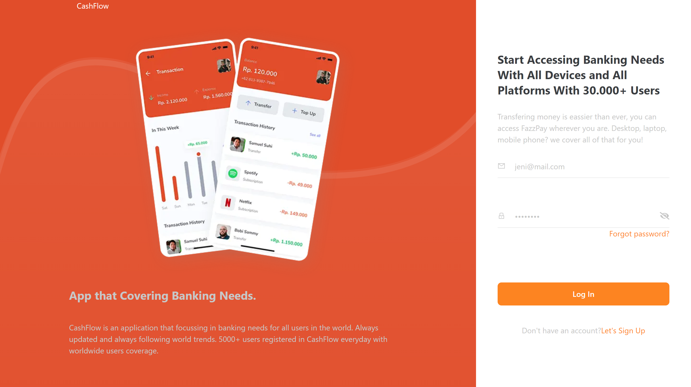
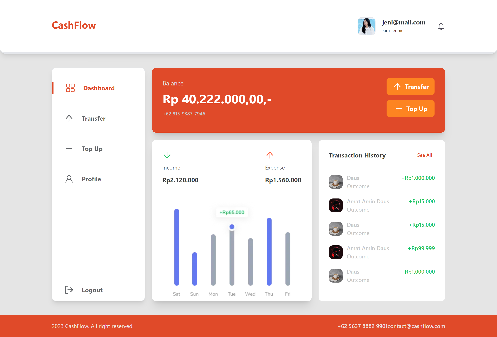
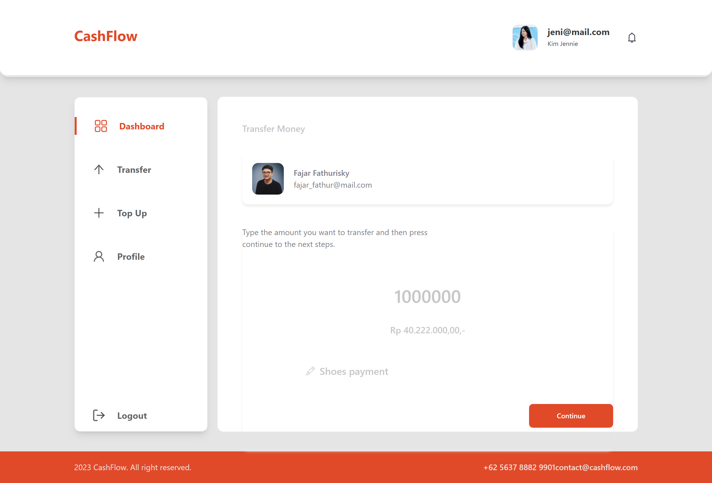

# CashFlow

is a web wallet application that can be used for transfers to friends, relatives or family.


## Display
- Home Page
- Events List
- Profile Page
- Checkout Page
## Build With
- [fontend](https://roastville.netlify.app/)
1. [React Native ](https://reactnative.dev/)

- [Backend](https://fw15-logpose-backend.vercel.app/)
1. [Node js](https://nodejs.org/en/)
2. [Express js](https://expressjs.com/en/starter/installing.html)
## Tech Stack
- [Redux](https://redux.js.org/)
- [Axios](https://axios-http.com/docs/intro)
- [Argon](https://www.npmjs.com/package/argon2)
- [jwt token](https://www.npmjs.com/package/jsonwebtoken)
- [Multer](https://www.npmjs.com/package/multer)
- [Moment](https://momentjs.com/)
- [Formik](https://formik.org/)

## Getting Start
### 1. Clone the project

```bash
  git clone https://github.com/arthuriski29/fw15-chiperpay-
```

## 2. Go to the project directory

```bash
  cd fw15-chiperpay-
```

### 3. Run the development server:

```bash
npm run dev
```
